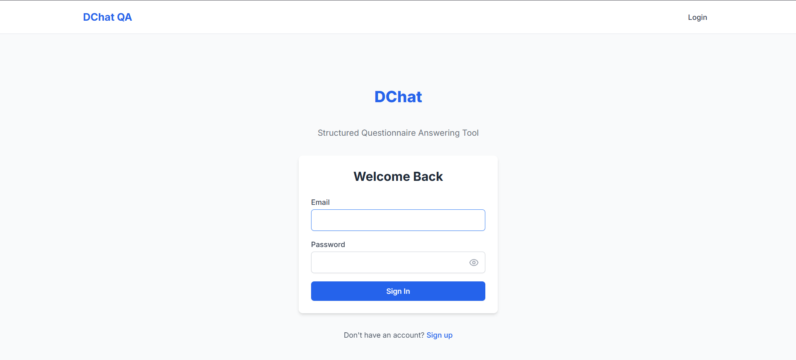
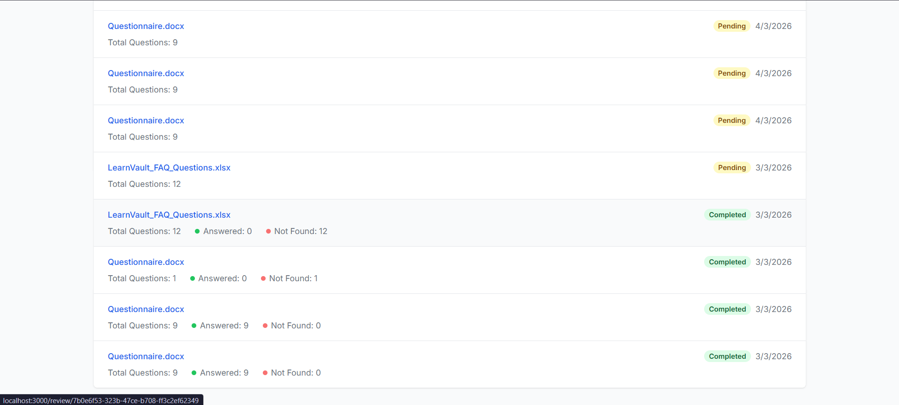
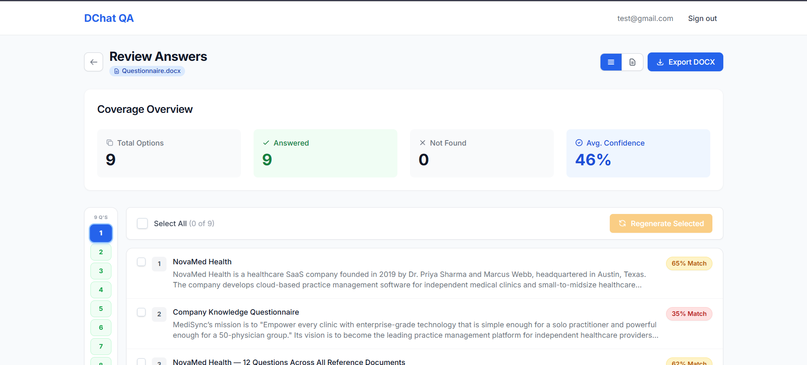
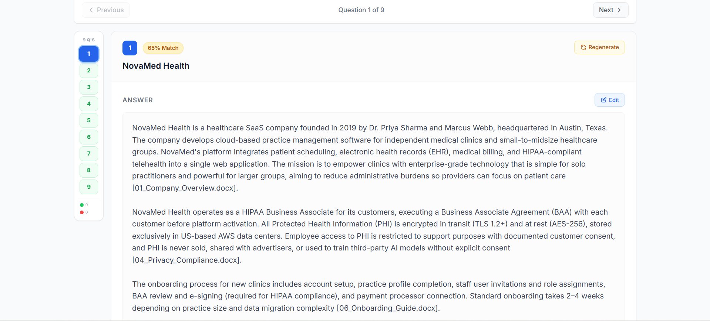
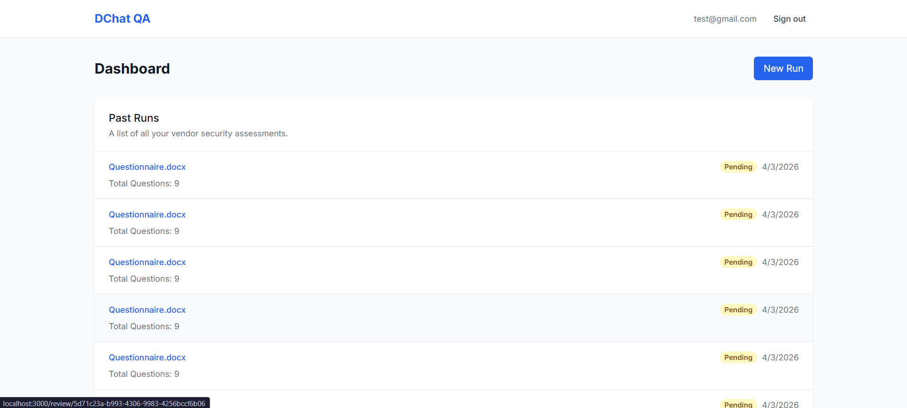
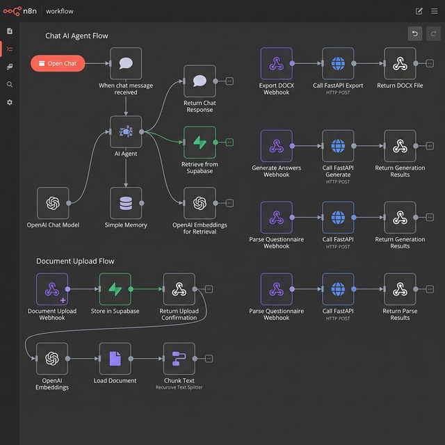

# DChat — AI-Powered Questionnaire Answering Tool

An AI-powered tool that automates completing vendor security assessments using internal reference documents. Built with a **RAG (Retrieval-Augmented Generation)** pipeline — upload a questionnaire and reference docs, and get structured, cited answers in seconds.

---

## How It Works

1. **Sign up / Log in** — Supabase Auth with email/password
2. **Upload a questionnaire** (PDF, XLSX, or DOCX) + reference documents
3. **Auto-generate answers** using a RAG pipeline (LangChain + OpenAI/GitHub Models + pgvector)
4. **Review & edit** generated answers with confidence scores and evidence snippets
5. **Export** a structured DOCX document preserving original question order with answers, citations, and confidence levels

---

## Screenshots

| Login | Dashboard |
|:---:|:---:|
|  |  |

| Review Questions | Edit Answers |
|:---:|:---:|
|  |  |

| Citations | Dashboard (v1) |
|:---:|:---:|
|  |  |

---

## Architecture

```
Next.js Frontend → API Routes (Proxy) → n8n (Orchestration) → FastAPI Backend → Supabase
                                                                              ↕
                                                                    LangChain + LLM (OpenAI / GitHub Models)
```

| Layer | Technology | Purpose |
|---|---|---|
| Frontend | Next.js 16, React 18, TypeScript, Tailwind CSS | UI — 6 pages + 3 API proxy routes |
| Auth | Supabase Auth (SSR) | Signup, login, session management, middleware-protected routes |
| Backend | FastAPI (Python) | All business logic + AI pipeline |
| RAG | LangChain + OpenAI GPT-4o-mini (or GitHub Models GPT-4.1) | Embeddings, retrieval, answer generation |
| Orchestration | n8n | Multi-step workflow coordination |
| Database | Supabase PostgreSQL + pgvector | Data storage + vector similarity search (1536-dim embeddings) |

### n8n Workflow



> 📖 **[View detailed n8n workflow documentation →](docs/README.md)**

---

## Feature Status

### Phase 1: Core Workflow — ✅ Complete

| Feature | Status | Notes |
|---|---|---|
| Sign up and log in | ✅ Done | Supabase Auth SSR, email/password, middleware-protected routes |
| Upload questionnaire (PDF/XLSX/DOCX) | ✅ Done | `FileUpload` component, backend `parser.py` (PyPDF2, openpyxl, python-docx) |
| Upload/store reference documents | ✅ Done | Multi-file upload, chunked & embedded via `ingest.py` (LangChain text splitters) |
| Parse questionnaire into individual questions | ✅ Done | Supports PDF, XLSX, DOCX formats |
| Retrieve relevant content from references | ✅ Done | pgvector similarity search via `match_chunks` SQL function |
| Generate answer per question | ✅ Done | `rag.py` — LangChain + configurable LLM provider |
| Citation per answer | ✅ Done | Source document name + similarity score attached |
| "Not found in references" fallback | ✅ Done | Returned when no relevant chunks exceed similarity threshold |
| Structured web view (Question / Answer / Citations) | ✅ Done | `QATable` + `QuestionNav` sidebar for navigation |

### Phase 2: Review & Export — ✅ Complete

| Feature | Status | Notes |
|---|---|---|
| Review and edit answers before export | ✅ Done | Inline editing on the review page with dynamic question navigation |
| Export as downloadable document | ✅ Done | DOCX via `export.py` + `python-docx` |
| Preserve original question order | ✅ Done | Questions exported in order |
| Keep original questions unchanged | ✅ Done | Only answers inserted alongside |
| Insert answers below/alongside questions | ✅ Done | Structured DOCX layout |
| Include citations with each answer | ✅ Done | Citations appended per answer in export |

### Nice-to-Have Features — ✅ 5 of 5 Implemented

| # | Feature | Status | Details |
|---|---|---|---|
| 1 | Confidence Score | ✅ Done | Avg cosine similarity, color-coded `ConfidenceBadge` component |
| 2 | Evidence Snippets | ✅ Done | Top retrieved chunks shown per answer with source & similarity % |
| 3 | Partial Regeneration | ✅ Done | `question_ids` param in `/generate` endpoint + UI regenerate button |
| 4 | Version History | ✅ Done | Dashboard shows all past runs with status, dates, and stats |
| 5 | Coverage Summary | ✅ Done | `CoverageSummary` component — total, answered, not-found, coverage %, avg confidence |

---

## Tech Stack

### Frontend

| Package | Version | Purpose |
|---|---|---|
| Next.js | 16.x | React framework (App Router) |
| React | 18.x | UI library |
| Tailwind CSS | 3.4.x | Utility-first CSS |
| @supabase/ssr | 0.8.x | Server-side Supabase auth |
| @supabase/supabase-js | 2.98.x | Supabase client |
| TypeScript | 5.x | Type safety |

### Backend

| Package | Purpose |
|---|---|
| FastAPI + Uvicorn | Async Python API server |
| LangChain + langchain-openai | RAG pipeline (embeddings + generation) |
| langchain-text-splitters | Document chunking |
| supabase-py | Database access |
| PyPDF2 | PDF parsing |
| openpyxl | XLSX parsing |
| python-docx | DOCX parsing + export generation |
| python-dotenv | Environment variable management |

### Infrastructure

| Service | Purpose |
|---|---|
| Supabase | Auth + PostgreSQL + pgvector + RLS |
| n8n | Workflow orchestration |
| OpenAI / GitHub Models | LLM provider (configurable) |

---

## Database Schema

5 tables managed in Supabase PostgreSQL with **Row Level Security (RLS)** enabled:

| Table | Purpose | Key Columns |
|---|---|---|
| `reference_docs` | Uploaded reference documents | `user_id`, `filename`, `storage_path` |
| `doc_chunks` | Chunked & embedded text (1536-dim vectors) | `doc_id`, `chunk_text`, `embedding` |
| `runs` | Questionnaire processing runs | `user_id`, `status`, `total_questions`, `answered_count` |
| `qa_pairs` | Questions + generated/edited answers | `run_id`, `question_text`, `generated_answer`, `edited_answer`, `confidence`, `citations`, `evidence_snippets` |
| `documents` | n8n chat vector store | `content`, `metadata`, `embedding` |

**SQL Functions:**
- `match_chunks` — cosine similarity search for the RAG pipeline
- `match_documents` — vector search for n8n chat integration

**Indexes:** IVFFlat vector index + lookup indexes on `user_id` and `run_id` columns.

---

## How to Run Locally

### Prerequisites

- Python 3.11+
- Node.js 18+
- A [Supabase](https://supabase.com) project (free tier works)
- An LLM API key — either:
  - [OpenAI API key](https://platform.openai.com/api-keys), **or**
  - [GitHub PAT](https://github.com/settings/tokens) for GitHub Models (free)

### 1. Database Setup

Run `db/setup_db.sql` in your Supabase SQL Editor to create all tables, vector search functions, RLS policies, and indexes.

### 2. Backend

```bash
cd backend
cp .env.example .env
# Fill in SUPABASE_URL, SUPABASE_SERVICE_KEY, and LLM config (see .env.example for options)
pip install -r requirements.txt
uvicorn main:app --reload --port 8000
```

**LLM Configuration Options** (in `.env`):

| Option | Base URL | Model | Key Variable |
|---|---|---|---|
| GitHub Models (free) | `https://models.github.ai/inference` | `openai/gpt-4.1` | `GITHUB_TOKEN` |
| OpenAI (paid) | `https://api.openai.com/v1` | `gpt-4o-mini` | `OPENAI_API_KEY` |

### 3. Frontend

```bash
cd frontend
npm install
# Create .env.local with:
#   NEXT_PUBLIC_SUPABASE_URL=https://your-project.supabase.co
#   NEXT_PUBLIC_SUPABASE_ANON_KEY=your-anon-key
#   BACKEND_API_URL=http://localhost:8000          (for direct FastAPI mode)
#   N8N_WEBHOOK_BASE_URL=https://your-n8n-url      (optional — for n8n orchestration)
npm run dev
```
## Assumptions

- Reference documents are English text documents (TXT, PDF, DOCX)
- Questionnaires have clearly structured questions (numbered rows in XLSX, numbered paragraphs in PDF/DOCX)
- Users upload both a questionnaire and reference documents per session
- One question = one answer (no multi-part sub-questions)
- Internet connectivity required for LLM API calls

## Next Phase Improvements

1. **Backend auth hardening** — Validate JWT tokens on every backend endpoint
2. **Streaming generation** — SSE for real-time per-question answer progress
3. **OAuth login** — Add OAuth login for Company Specific users.
4. **PDF export** — Add PDF alongside DOCX downloads
5. **Hybrid retrieval** — Combine pgvector with BM25 keyword search
6. **Semantic chunking** — Split documents by headings/sections instead of fixed windows
7. **Batch operations** — Batch insert chunks and answers for performance
8. **File lifecycle** — Auto-cleanup temp/exported files
